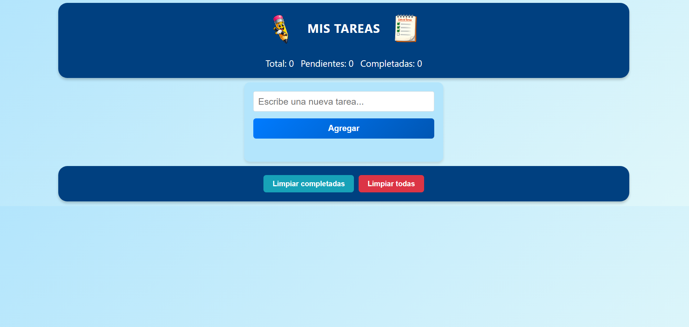

# PARCIAL N°1:

## Lista de Tareas

Aplicación web simple para gestionar tareas que permite agregar, completar y eliminar tareas, además de visualizar contadores en tiempo real



## GRUPO N°2:
- Franco Sinigaglia
- Joaquin Pignotti
- Lucia Aguero
- Mateo Barrera
- Ricardo Herbas
- Ignacio Painenahuel Luna


## Tecnologías utilizadas: HTML, CSS y Javascript 

## Estructura del proyecto
```
/proyecto
│
├── index.html
├── README.md
│
├── /css
│   └── style.css
│
└── /js
    └── script.js
```

## Lógica principal

Se captura el evento `submit` del formulario para agregar nuevas tareas y se utiliza `actualizarLista()` para reflejar los cambios en la interfaz. Luego, mediante eventos asociados a los botones, se permite completar o eliminar tareas, mientras que los contadores se actualizan automáticamente a través de `actualizarContadores()`.

---


## Funcionalidades

 ```agregarTarea() ```

Descripción: Crea una nueva tarea a partir del valor ingresado en el campo de entrada y la agrega al arreglo tareas. Luego actualiza la interfaz de usuario.
```
   function agregarTarea() {
    const texto = input.value.trim();
    if (texto === "") return;

    tareas.push({
        texto: texto,
        completada: false
    });

    input.value = "";
    actualizarLista();
}
```
Obtiene el valor del input mediante `input.value`, elimina los espacios en blanco utilizando `trim()` y valida que el texto no esté vacío. Después agrega el objeto al arreglo tareas con `push`, limpia el input y llama a `actualizarLista()` para actualizar la lista


 ```actualizarLista() ```

Descripción: Renderiza completamente la lista de tareas en el DOM a partir del estado actual del arreglo tareas.
```
function actualizarLista() {
    lista.innerHTML = "";

    tareas.forEach((tarea, index) => {

        const li = document.createElement("li");

        const span = document.createElement("span");
        span.textContent = tarea.texto;

        if (tarea.completada) {
            span.classList.add("completada");
        }

        const btnCompletar = crearBotonCompletar(index);
        const btnEliminar = crearBotonEliminar(index);

        li.appendChild(span);
        li.appendChild(btnCompletar);
        li.appendChild(btnEliminar);

        lista.appendChild(li);
    });

    actualizarContadores();
}
```
Limpia el contenido actual del contenedor estableciendo `innerHTML` en una cadena vacía, luego recorre el arreglo `tareas` mediante `forEach`, creando dinámicamente elementos HTML como `li`, `span` y `button`. Si una tarea está completada, aplica la clase CSS correspondiente. Finalmente, inserta los elementos en el DOM y llama a `actualizarContadores()`.


 ```crearBotonCompletar(index) ```

Descripción: Genera un botón que permite alternar el estado de completado de una tarea

```
    function crearBotonCompletar(index) {
        const btnCompletar = document.createElement("button");
        btnCompletar.textContent = "✔";

        btnCompletar.addEventListener("click", () => {
            tareas[index].completada = !tareas[index].completada;
            actualizarLista();
});
    return btnCompletar;
}
```
Parámetros
: index (number): índice de la tarea dentro del arreglo tareas

Valor de retorno:
HTMLButtonElement

Crea un elemento de tipo `button` y le asigna el texto "✔" como contenido visible. Agrega un evento `click` que cambia el valor de completada y actualiza la lista con `actualizarLista()`. Finalmente, retorna el botón creado.


 ```crearBotonEliminar(index) ```

Descripción: Genera un botón que elimina una tarea específica del arreglo tareas
```
    function crearBotonEliminar(index) {
        const btnEliminar = document.createElement("button");
        btnEliminar.textContent = "✖";

        btnEliminar.addEventListener("click", () => {
            tareas.splice(index, 1);
            actualizarLista();
    });

        return btnEliminar;
    }
```
Parámetros: index (number): índice de la tarea dentro del arreglo tareas

Valor de retorno: HTMLButtonElement

Crea un elemento de tipo `button` y le asigna el texto "✖" como contenido visible. Al hacer click, elimina la tarea con `splice` y actualiza la lista con `actualizarLista()`.


 ```actualizarContadores() ```

 Descripcion: Calcula y actualiza los valores de tareas totales, completadas y pendientes en la interfaz

```
    function actualizarContadores() {
        const totalTareas = tareas.length;
        const completadasTareas = tareas.filter(t => t.completada).length;
        const pendientesTareas = totalTareas - completadasTareas;

        total.textContent = `Total: ${totalTareas}`;
        completadas.textContent = `Completadas: ${completadasTareas}`;
        pendientes.textContent = `Pendientes: ${pendientesTareas}`;
    }

```
Calcula el total de tareas usando la propiedad `length` del arreglo, obtiene cuántas están completadas mediante el método `filter`, determina las pendientes por diferencia y luego actualiza los valores mostrados en los elementos del DOM.


